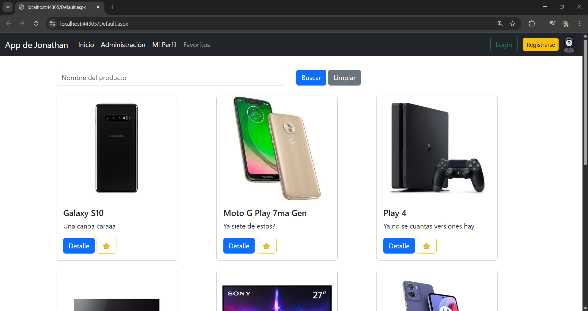
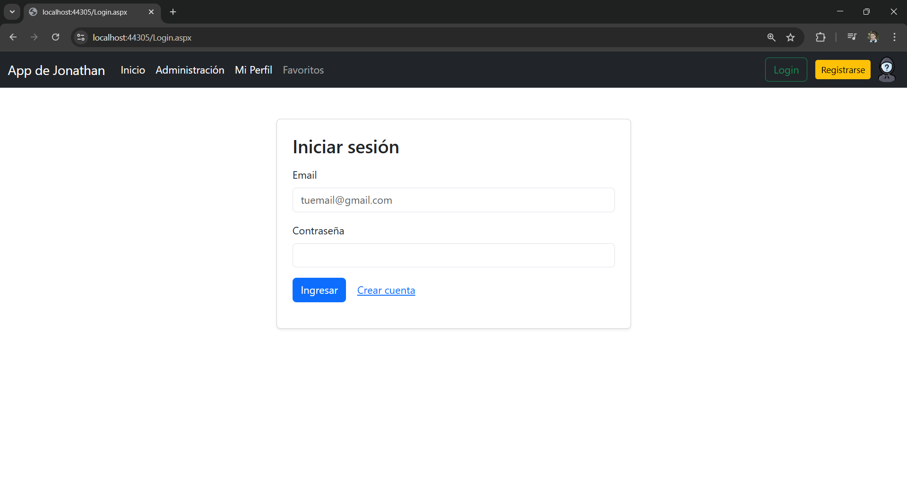
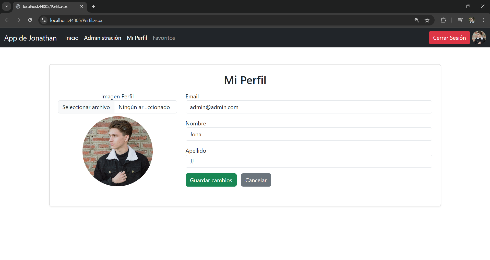
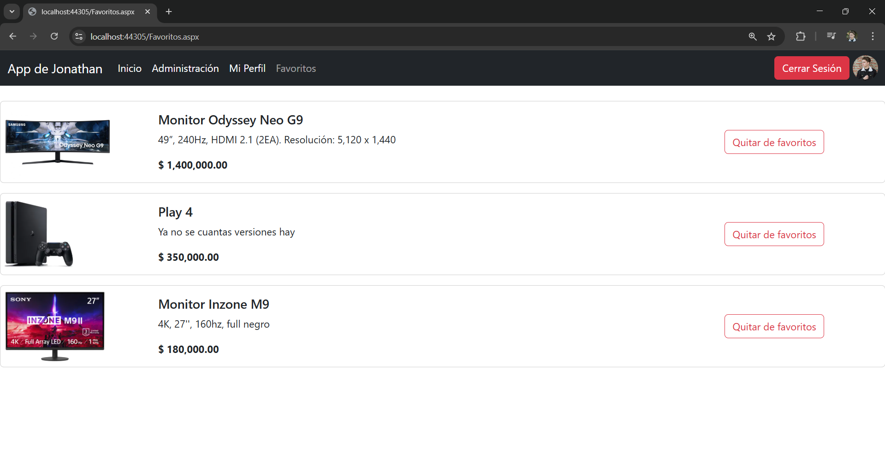
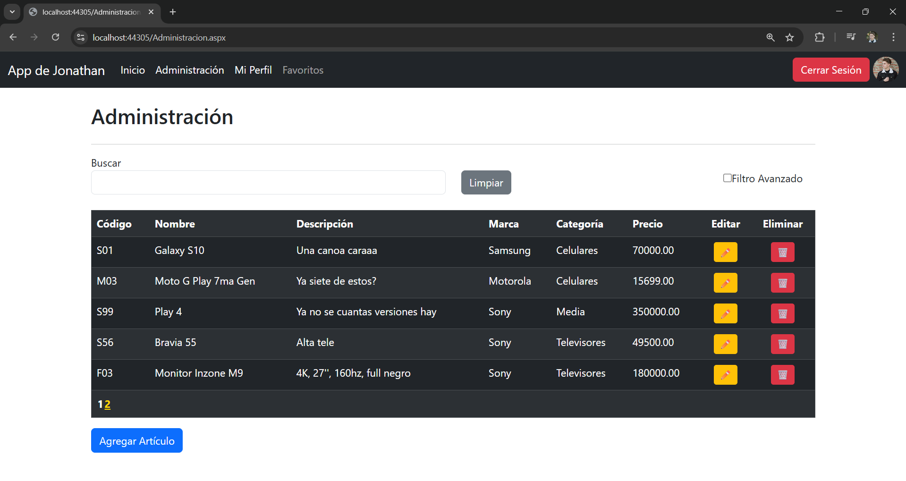
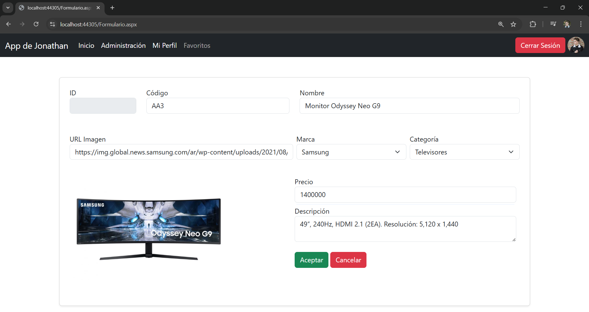

# App Web – Gestión de Artículos

Aplicación web desarrollada en **ASP.NET WebForms** orientada a comercios o emprendimientos que necesitan exhibir y administrar un catálogo de productos.  
Incluye autenticación de usuarios, gestión de perfiles y funcionalidades de favoritos.

---

## 🚀 Funcionalidades principales

- Registro y login de usuarios
- Gestión de sesión
- Perfil de usuario con carga de imagen
- Listado de artículos con filtros
- Sistema de favoritos
- Área administrativa con control de acceso
- Manejo centralizado de errores

---
## Capturas de pantalla

### Catálogo

### Login

### Perfil de usuario

### Favoritos

### Administración

### Alta de artículo

---

## 🛠️ Tecnologías utilizadas

- C#
- ASP.NET WebForms
- SQL Server
- ADO.NET
- Bootstrap

---

## 🧱 Arquitectura

El proyecto está organizado en capas:
- **Dominio**: entidades del sistema
- **Negocio**: lógica de negocio y acceso a datos
- **Presentación**: WebForms - HTML,CSS,JS

---

## 📌 Estado del proyecto

Proyecto finalizado –  
Trabajo Práctico Final del curso **C# Nivel 3**.
Podés probarlo acá: http://www.jonagestioncatalogo.somee.com/
Video demostrativo: 
https://www.linkedin.com/posts/jonathanjordanferreyra_programacion-csharp-aspnet-activity-7410463436507209728-4MDq?utm_source=share&utm_medium=member_desktop&rcm=ACoAAFrKnr4BhH3SoZRkqKiP4TDQ3u1D3F1744Q
---

## 👤 Autor

Jonathan Jordán Ferreyra  
Estudiante de Desarrollo de Software
